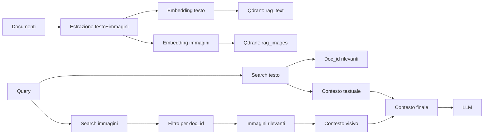
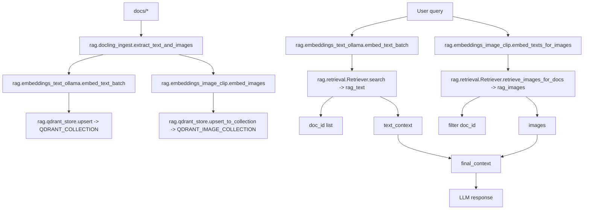

# RAG Project (Local)

Questo progetto implementa un RAG (Retrieval-Augmented Generation) interamente in locale, con ingestion, embedding e retrieval su documenti PDF.

**Stack e servizi**
- Qdrant: vector database locale (via Docker) per lo storage degli embedding
- Ollama:
  - `embeddinggemma`: modello per l'embedding del testo
  - `llama3.2`: LLM per il retrieval e la risposta
- Docling: parser che converte PDF in HTML strutturato per preservare la struttura durante l'embedding

**Requisiti**
- Python (virtual environment)
- Docker (per Qdrant)
- Ollama installato e avviato
- Dipendenze Python in `requirements.txt`

**Struttura del progetto**
- `rag/`: librerie e codice per ingestion, embedding e retrieval
- `scripts/`: script di test per ingestion ed esecuzione RAG
- `docs/`: documenti da indicizzare (PDF)

**Setup**
1. Crea e attiva il virtual environment
   ```powershell
   .\.venv\Scripts\Activate.ps1
   ```
2. Installa le dipendenze
   ```powershell
   pip install -r requirements.txt
   ```

**Uso**
1. Ingestion + embedding
   ```powershell
   python scripts/ingest.py
   ```
2. Retrieval (test di risposta RAG)
   ```powershell
   python scripts/test_rag_answer.py
   ```

**Diagrammi**

Diagramma semplice


Diagramma tecnico (con moduli reali)


**Note**
- La dimensione dei chunk per l'embedding e configurabile direttamente negli script.

