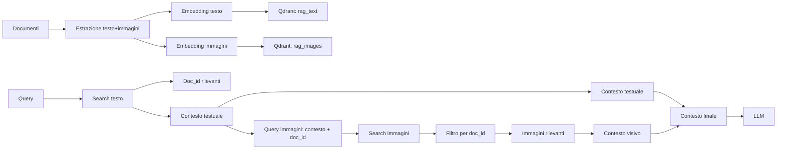
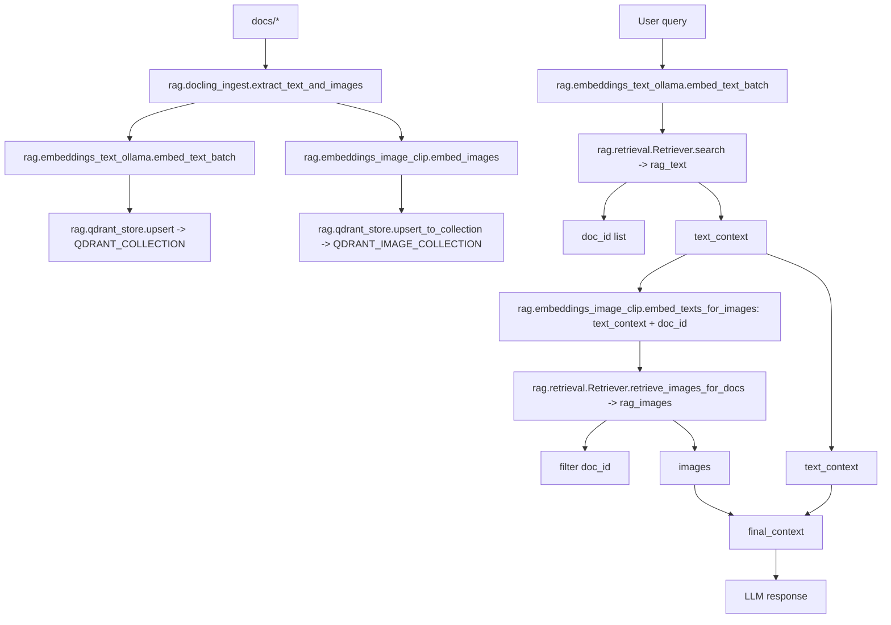

# RAG Project (Local)

Questo progetto implementa un sistema RAG (Retrieval-Augmented Generation) interamente in locale, pensato per indicizzare e interrogare documenti PDF senza dipendenze da servizi cloud. L’idea alla base è costruire una pipeline semplice ma solida che consenta ingestion, embedding e retrieval dei contenuti, mantenendo il controllo completo sui dati e sull’infrastruttura.

Il sistema si basa su alcuni componenti principali:
- Qdrant, utilizzato come vector database locale per memorizzare e interrogare gli embedding
- Ollama, impiegato sia per la generazione degli embedding testuali sia per l’esecuzione del modello LLM
- Docling, usato per convertire i PDF in contenuti strutturati, preservandone la struttura durante l’indicizzazione

In particolare, lo stack tecnologico prevede:
- Qdrant eseguito localmente tramite Docker
- Ollama con il modello embeddinggemma per l’embedding del testo
- Ollama con il modello llama3.2 per il retrieval e la generazione delle risposte
- Un ambiente Python con virtual environment e dipendenze gestite tramite requirements.txt

Per eseguire il progetto sono necessari:
- Python 3.10 o superiore
- Un virtual environment attivo
- Docker installato e funzionante
- Ollama installato e avviato in locale

La struttura del progetto è organizzata in modo da separare chiaramente le responsabilità:
- la cartella rag contiene il codice core per ingestion, embedding e retrieval
- la cartella scripts raccoglie gli script di esecuzione e di test del flusso RAG
- la cartella docs contiene i documenti PDF da indicizzare

Una volta clonato il repository, il flusso di utilizzo tipico è il seguente:
- creazione e attivazione del virtual environment
- installazione delle dipendenze Python
- avvio dei servizi locali necessari (Qdrant e Ollama)
- esecuzione dello script di ingestion per indicizzare i documenti
- esecuzione dello script di retrieval per testare il sistema RAG

Durante la fase di ingestion, i PDF presenti nella cartella docs vengono convertiti in contenuti strutturati, suddivisi in chunk e trasformati in embedding testuali e visivi. Questi embedding vengono poi salvati su Qdrant in collezioni separate, in modo da supportare un retrieval multimodale più flessibile.

Durante la fase di retrieval, la query dell’utente viene embeddizzata e confrontata con gli embedding presenti nel database. I contenuti più rilevanti vengono selezionati, il contesto testuale e visivo viene fuso e infine passato al modello LLM, che genera la risposta finale.

L???architettura complessiva del sistema ?? riassunta nei diagrammi seguenti.

Diagramma semplice

Diagramma tecnico (con moduli reali)

